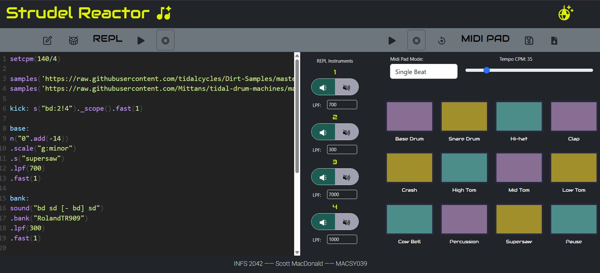

# Strudel Reactor

## Overview

This web application was developed as a part of the INFT 2064 Web Technology course work. 

It is a React Application which builds upon the Strudel.cc npm libraries to provide an interface for the user to orchestrate, play, and modify songs using the strudel REPL, or via a no-code midi pad drum machine.

It features two main panels which provide alternative ways to interact with the libraries and create sound effects.
1) Strudel REPL - the left panel features the traditional strudel REPL where you can write strudel code to construct your songs.
2) Midi Pad - the right panel features a midi pad drum machine which allows you to construct songs from layered sound loops, a no-code solution for interacting with strudel.

### Features

A quick summary of the features provided by the application interfaces:

GLOBAL:
- Notification system to inform users about important alerts and provide feedback on actions

REPL
- Write code directly into the REPL and use pause/play buttons to interact and play sounds
- Use the pre-processor editor to apply custom <> tags which allow instant modifications to REPL code via different settings 
- Use the advanced settings panel to change the default drum effect and instrument group playback speed
- Use the basic setings (right of REPL) to mute instruments or apply low pass filters to sound output
- Click the visualiser to see a bar chart or line chart visual of the sounds being played

MIDI PAD
- Use single beat mode to test the instrument noises for a single sound effect
- Use loop mode to build up to 6 layers of looped sound effects to create beats from single sounds at specified cycle speed
- Play, pause, and clear currently created loops
- Save custom sound loops to local storage for importing
- Import saved custom sound loops from local storage

### Installation / Dependencies

The following dependencies are required to install and use this application

[Node Js](https://nodejs.org/en/download)

Installation steps
1) Clone this repository locally `git clone https://github.com/scottmacuni/strudel_reactor_infs2042.git`
2) Navigate to repo root folder in terminal `cd strudel_reactor_infs2042`
3) Install npm dependencies `npm install`
4) Run local server `npm start`
5) Navigate to localhost:3000 to view application (see terminal output for your localhost port in case of clashes)

### Folder structure

- /src: source code root folder, top level components, entry points, styles, config
    - App.jsx: main app parent
    - index.js: entry point for rendering in web page
    - App.css: main stylesheet
    - /pages: contains main page used in SPA, top level page component
        - Home.jsx: main app page, top level state management
    - /components: contains all modular components used
        - GlobalOptions.jsx: main top bar options and settings
        - StrudelRepl.jsx: left side application panel
        - /midipad: contains all components relating to right side midi pad panel
        - /popups: contains all pop up components used in application
    - /lib: contains helper functions and global constants used in application

### Demo Video
Accessible as an unlisted YouTube video

[View Demo](https://youtu.be/lTTh5vQtqWM)

## User Guide
Preprocessor Syntax Cheatsheet

\<drum> : place this tag inside of a .bank() method in the pre-processor for the advanced setting drum selection to apply 
usage eg. `sound(...).bank(<drum>)` will replace the <drum> with whatever drum is selected in advanced settings.

<id_radio> : place this tag before the instrument declaration in the pre-processor to enable it to be muted via the instrument settings buttons right of the REPL 
usage eg. `<1_radio>snare` will mean that the snare instrument will be muted with the 1 id mute radio button is clicked.

<id_lpf> : place this tag inside of a .lpf() method in the pre-processor for the LPF value to be applied as a low pass filter which modifies the sound volume
usage eg. `sound(...).lpf(<1_lpf>)` will mean that the value displayed in the 1 LPF setting will be applied as the low pass filter value.

<id_speed> : place this tag inside of a .fast() method in the pre-processor for the advanced setting speed selection to be applied
usage eg. `sound(...).fast(<1_speed>)` will mean that the value selected in advanced settings will be applied, options include default speed, half speed, or double speed.

### Main Panels

REPL
- Type into the REPL to make direct changes to the REPL code being played
- Edit icon button (top-left): opens pre-processor pop up to apply custom pre-process tags (see cheatsheet above)
- Drum icon button (top-left): opens advanced settings popup to apply drum selection and instrument playback speed settings
- Play/Pause icon button (top-left): play/pause REPL
- REPL instruments panel (right of REPL, middle screen):
    - Mute radio button: mute/un-mute instruments tagged with <id_radio>
    - LPF input: set the LPF filter vaue for instruments tagged with <id_lpf>
- Top right disco ball icon: opens the visualiser panel which displays sound visuals when REPL playing

MIDI PAD
- Play/Pause (top-right): when a sound loop is loaded in memory, will play or pause that loop
- Reset (top-right): clears the current loop loaded in memory
- Mode select: switches between single and looped sound mode for sound effects
- Layer select: when in loop mode, selects the current layer you want to build a loop for, up to 6 layers
- Tempo CPM slider: when in loop mode, sets the tempo speed in cycles per minute which is applied to the looped beats
- Sound buttons:
    - In single beat mode will play the sound once and stop
    - In loop mode will add that sound to the current layer selected and begin playing loop in current state
- Save icon button (top-right): opens the save loop panel, allowing export of loop to local storage
- Load icon button (top-right): opens the load loop panel, allowing import of saved loops from local storage 

### POPUPS

PRE-PROCESSOR
- Type into the textarea to apply tags, or modify the REPL code
- Save button: applies changes, processes tags accordingly, upadates REPL, alerts user of changes
- Close button: closes popup and aborts changes

ADVANCED SETTINGS
- Drum select: applies the selected drum to all <drum> tags, instantly applied on select
- Instrument speed select: applied the selected speed to the instruments with <id_speed>, instantly applied on select
- Close button: closes popup

SAVE LOOP
- Provide a reference ID for the current loop created
- Save button: exports loop to local storage under ID reference name
- Close button: closes popup, if not saved aborts changes

LOAD LOOP
- Use select to choose the ID of the loop to import
- Load button: will load selected loop into memory, overwriting current loop
- Close button: closes popup

VISUALISER
- Will auto display sound visuals when REPL playing
- Setting select: choose between bar chart and line chart visual display

### Notes / Quirks

- There are 4 primary instrument ids which can be used for applying pre-processor modifications in the REPL. IDs can be reused which will apply the setting to multiple instruments, eg <1_radio> can be applied to all instruments, which will then all be muted when clicking the 1 Radio button in the application. The provided ids are 1 -> 4, using Ids outside of this range will not apply changes and is not currently supported.
- Drum selection is not specified on an instrument level, all <drum> tags will be changed to the global selection.
- The REPL and Midi Pad can be played at the same time but is hard to sync their cycles for a smooth sounding beat, good luck.
- The viualizer only works for REPL sound output, not the midi pad.
- You can only create up to 6 layers in the midi pad drum machine. Not all layers need to be utilized, a beat can use 1 -> 6 layers, no more, no less.
- You can't currently undo a layer, if you make a mistake when creating a layer, you will need to clear and restart unless you had saved to previous layer to local storage, in which case it can be imported and started from last save.
- You must click 'save' in the pre-processor popup for the changes to be applied in the REPL
- Pre-processor tags must be applied inside the pre-processor and cannot be applied directly in the REPL
- You can't save a empty loop to local storage, atleast one sound, in one layer required
- If you haven't saved a loop to local storage, you won't have anything to import

### Bonus Points

- Created custom REPL song using various instruments, patterns, sounds, and custom pre-processor additions
- Ability to use both REPL and Midipad functionality in sync for unique combinations

## Limitations / Improvements

- Given more time, it would be nice to implement dynamic ID naming conventions and support for as many instrument IDs as the user wants. The current limitation of 4 IDs gives a lot of flexibility and combinations which can be applied, but means that some instruments must be grouped together to allow settings to apply to all instruments in the case where > 4 instruments are used.